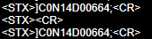

# DLA_DLCODE-SCRIPTS
### #1_FirstExample.js
> Sends custom string to output for each reading phase
### #2_LogicalTest.js
> Collect the first barcode content and check if last two characters are "NO", IF true, send "NO" to output
### #3_CollectAllCodes.js
> Iterate through codes object and find all codes and which slave device it was scanned on
### #4_AddAIMID.js
> Iterate through all codes, if symbology is CODE128, also add aimID to output message

